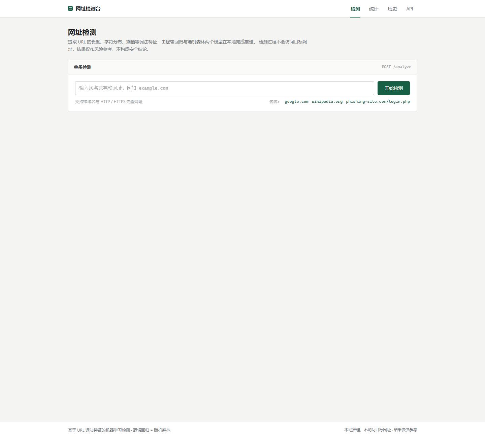
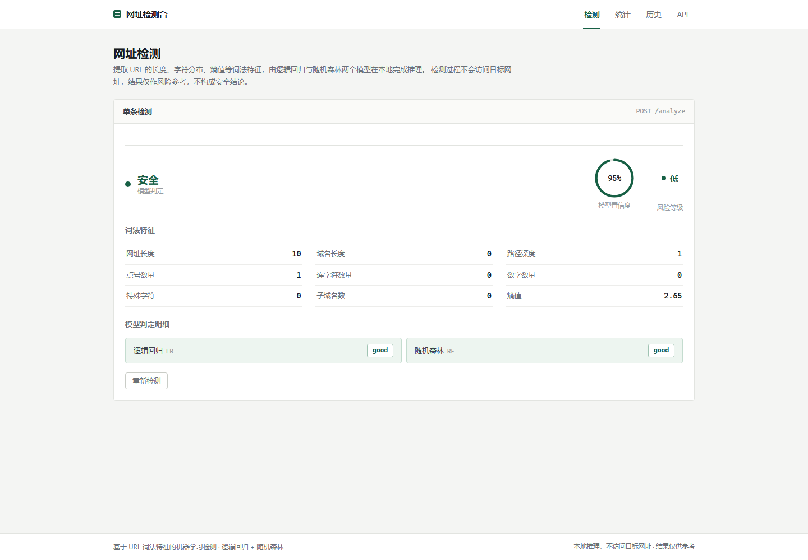
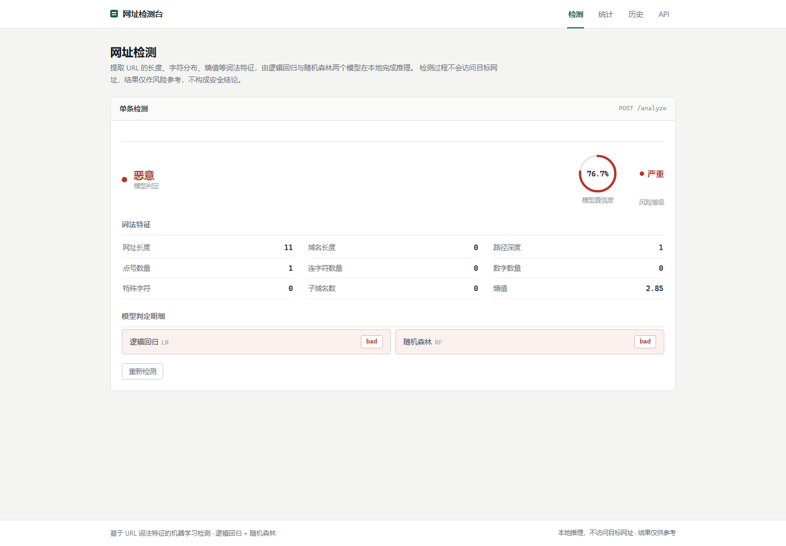
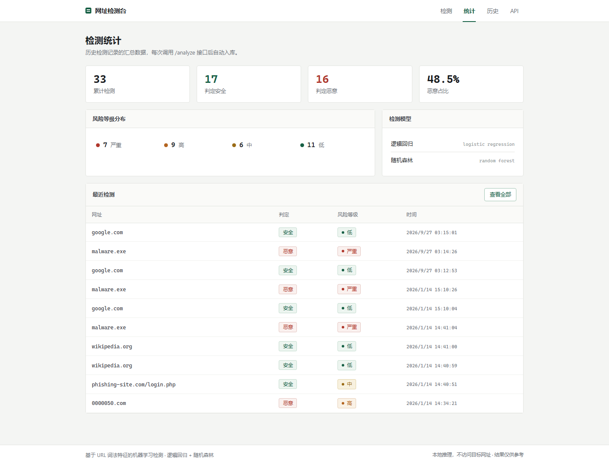
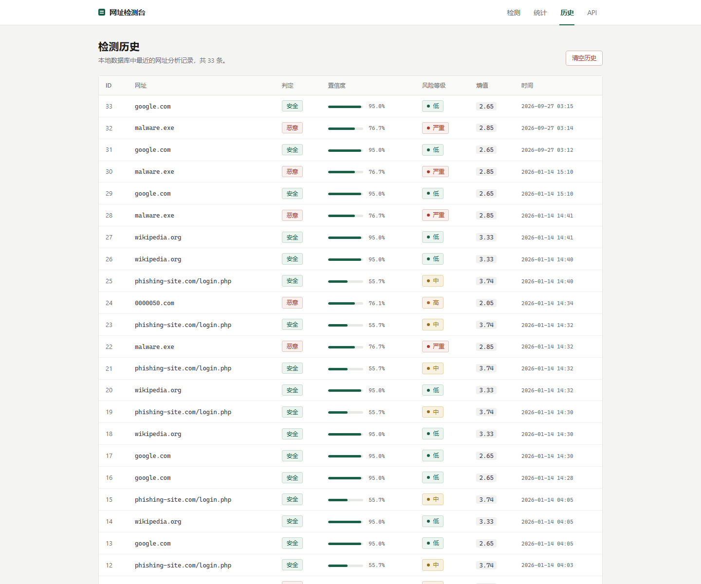
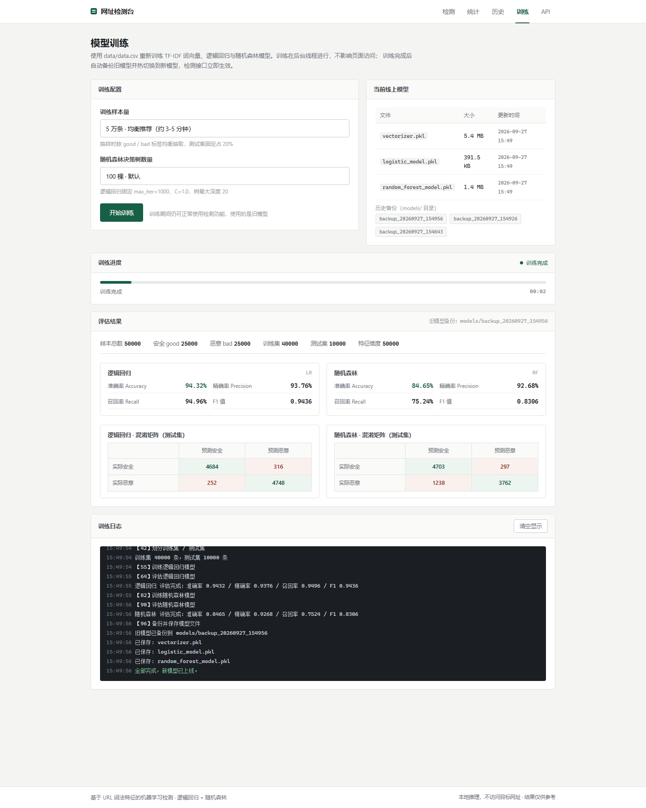

# 恶意网址检测系统（Malicious URL Detection）
# 源码获取：https://mbd.pub/o/bread/YZaVmJltZA==
基于 **URL 词法特征 + 机器学习** 的恶意网址检测平台。使用 TF-IDF 提取 URL 特征，由 **逻辑回归（Logistic Regression）** 与 **随机森林（Random Forest）** 双模型投票判定，并在 Web 端提供单条检测、批量检测、统计分析、历史记录、模型训练与版本回滚等完整能力。

> 全部推理在本地完成，**不会访问目标网址**，结果仅作风险参考，不构成安全结论。


---

## 目录

- [功能特性](#功能特性)
- [界面预览](#界面预览)
- [技术栈](#技术栈)
- [项目结构](#项目结构)
- [快速开始](#快速开始)
- [数据集说明](#数据集说明)
- [检测原理](#检测原理)
- [API 文档](#api-文档)
- [模型训练与版本管理](#模型训练与版本管理)
- [辅助脚本](#辅助脚本)
- [常见问题](#常见问题)
- [免责声明](#免责声明)

---

## 功能特性

- **单条检测**：输入域名或完整 URL，实时返回安全 / 恶意判定、置信度、风险等级、命中规则与词法特征明细。
- **双模型集成**：逻辑回归 + 随机森林投票，界面展示两个模型各自的判定，模型不一致时给出复核提示。
- **批量检测**：每行一条网址（兼容逗号 / 分号 / 空格分隔），单次最多 500 条，支持导出 CSV。
- **风险评分**：在模型判定之外叠加规则评分（IP 直连、可疑后缀、诱导词、超长 URL、字符熵等），输出 `low / medium / high / critical` 四级风险。
- **可信站点白名单**：命中内置白名单域名时直接覆盖为安全结果，降低常见站点误报。
- **统计分析**：累计检测量、安全 / 恶意占比、风险等级分布、最近检测记录。
- **历史记录**：检测记录自动入库（SQLite），支持查看最近 100 条与一键清空。
- **在线训练**：Web 端配置样本量与决策树数量，后台线程训练，实时进度与日志，输出准确率 / 精确率 / 召回率 / F1 与混淆矩阵。
- **热切换与回滚**：训练完成自动备份旧模型、原子替换并热切换，检测接口无需重启即可生效；支持一键回滚到任意历史版本。
- **RESTful API**：全部能力均提供 JSON 接口，方便集成到其他系统。

---

## 界面预览

| 检测台 | 安全结果 |
| --- | --- |
|  |  |

| 恶意结果 | 检测统计 |
| --- | --- |
|  |  |

| 检测历史 | 模型训练 |
| --- | --- |
|  |  |

---

## 技术栈

| 层次 | 技术 |
| --- | --- |
| Web 框架 | Flask、Flask-SQLAlchemy |
| 机器学习 | scikit-learn（`TfidfVectorizer`、`LogisticRegression`、`RandomForestClassifier`） |
| 数据处理 | pandas、numpy、scipy |
| 数据库 | SQLite |
| 前端 | Jinja2 模板、Bootstrap 5、原生 JavaScript |
| 并发 | Python `threading`（后台训练线程） |

---

## 项目结构

```
Using-machine-learning-to-detect-malicious-URLs/
├── AIserver.py              # Flask 主服务：检测接口 + 训练子系统 + 数据模型
├── train_model.py           # 基础训练脚本（全量数据）
├── train_model_cleaned.py   # 使用清洗后数据（data_cleaned.csv）训练
├── train_model_optimized.py # 优化版训练（class_weight、max_features、min_samples 等）
├── clean_data.py            # 数据清洗：排查误标注样本
├── clean_and_train.py       # 清洗并导出 data_cleaned.csv
├── deep_clean.py            # 深度清洗：更全面的可信域名 / 恶意模式过滤
├── analyze_data.py          # 数据集分布与样本抽查
├── check_predictions.py     # 查看最近检测记录（命令行）
├── REQUIREMENTS             # 原始依赖清单
├── templates/               # Jinja2 页面模板
│   ├── base.html            # 公共布局与导航
│   ├── index.html           # 单条检测
│   ├── batch.html           # 批量检测
│   ├── dashboard.html       # 检测统计
│   ├── history.html         # 检测历史
│   ├── train.html           # 模型训练
│   └── api_docs.html        # API 文档页
├── static/
│   ├── css/style.css        # 样式
│   └── js/main.js           # 前端逻辑（检测 / 统计 / 历史 / 训练）
├── models/                  # 模型产物
│   ├── vectorizer.pkl       # TF-IDF 向量器
│   ├── logistic_model.pkl   # 逻辑回归模型
│   ├── random_forest_model.pkl  # 随机森林模型
│   └── backup_YYYYMMDD_HHMMSS/  # 历史模型备份（版本回滚用）
├── data/
│   ├── data.csv             # 训练数据集（url,label）
│   ├── data_cleaned.csv     # 清洗后的数据集
│   └── MISP_extract_bad.py  # 从 MISP 导出中提取恶意 URL
├── detection_history.db     # SQLite 数据库（检测记录 + 训练记录）
└── 截图/                     # 界面截图
```

---

## 快速开始

### 环境要求

- Python 3.8 及以上
- pip

### 安装依赖

```bash
pip install flask flask-sqlalchemy scikit-learn pandas numpy scipy
```

> 仓库中的 `REQUIREMENTS` 为原始依赖清单（版本较旧）。若沿用旧版本，请确保 `pandas` / `scikit-learn` 版本与 Python 版本匹配；否则建议直接安装上述最新稳定版。

### 启动服务

```bash
python AIserver.py
```

启动后访问 **http://127.0.0.1:5000/**。

服务启动时会自动从 `models/` 加载训练好的模型：

```
正在从 ./models 加载训练好的模型...
已加载: logistic
已加载: random_forest
所有模型加载完成!
```

若 `models/` 目录缺失或加载失败，会自动读取 `data/data.csv` 重新训练。

服务默认监听 `0.0.0.0:5000`，端口可通过环境变量 `VCAP_APP_PORT` 覆盖。

### 页面入口

| 路径 | 说明 |
| --- | --- |
| `/` | 单条检测台 |
| `/batch` | 批量检测 |
| `/dashboard` | 检测统计 |
| `/history` | 检测历史 |
| `/training` | 模型训练与版本管理 |
| `/api/docs` | API 文档 |

---

## 数据集说明

数据集位于 `data/data.csv`，为两列 CSV，约 **42 万条** 记录：

```csv
url,label
diaryofagameaddict.com,bad
espdesign.com.au,bad
iamagameaddict.com,bad
...
google.com,good
```

| 字段 | 类型 | 说明 |
| --- | --- | --- |
| `url` | string | 网址（裸域名或完整 URL） |
| `label` | string | `good`（安全）或 `bad`（恶意） |

数据来源包括公开的恶意网址数据集与 **MISP** 威胁情报导出（见 `data/MISP_extract_bad.py`），并经过多轮清洗（`clean_data.py` / `deep_clean.py`）剔除误标注样本。

---

## 检测原理

### 1. 特征提取（词法特征）

**文本特征（TF-IDF）**：使用自定义分词器 `getTokens` 按 `/`、`-`、`.` 切分 URL，再由 `TfidfVectorizer` 转换为向量。

**数值特征（16 维）**，由 `extract_features()` 提取：

| 特征 | 说明 |
| --- | --- |
| `url_length` | URL 总长度 |
| `domain_length` | 域名长度 |
| `path_depth` | 路径层级 |
| `num_dots` / `num_hyphens` / `num_underscores` / `num_slashes` | 各类符号数量 |
| `num_digits` | 数字字符数量 |
| `num_special_chars` | 特殊字符（`@!#$%^&*()+=`）数量 |
| `has_ip` | 是否直接使用 IP 地址 |
| `has_suspicious_words` | 是否命中诱导词（login / verify / secure / paypal 等） |
| `has_extension` | 是否含脚本或可执行后缀（exe / js / bat / sh / php / asp / jsp / pdf） |
| `entropy` | 字符香农熵 |
| `has_port` | 是否显式指定端口 |
| `num_subdomains` | 子域名层级 |
| `has_https` | 是否使用 HTTPS |

### 2. 模型判定

- **逻辑回归**：`max_iter=1000`，`C=1.0`
- **随机森林**：`n_estimators=100`，`max_depth=10`
- **集成策略**：两个模型投票取多数，置信度取两模型对最终类别的概率均值。

### 3. 风险评分

在模型判定基础上叠加规则得分，输出风险等级：

| 规则 | 分值 |
| --- | --- |
| 模型判定为恶意 | +50 |
| 置信度 > 90% / > 70% | +20 / +10 |
| 直接使用 IP 地址 | +15 |
| 含脚本或可执行后缀 | +20 |
| 命中可疑诱导词 | +10 |
| URL 长度 > 100 | +10 |
| 特殊字符 > 5 个 | +10 |
| 字符熵 > 4.5 | +15 |
| 子域名层级 > 3 | +10 |

| 累计得分 | 风险等级 |
| --- | --- |
| ≥ 70 | `critical`（严重） |
| ≥ 50 | `high`（高） |
| ≥ 30 | `medium`（中） |
| < 30 | `low`（低） |

> 命中可信站点白名单时，直接覆盖为 `good` / `low`。

---

## API 文档

所有接口均为 JSON 格式，可直接集成调用。

### `POST /analyze` — 分析单个网址

请求：

```json
{ "url": "https://example.com" }
```

响应：

```json
{
  "url": "https://example.com",
  "prediction": "good",
  "confidence": 98.75,
  "risk_level": "low",
  "individual_predictions": { "logistic": "good", "random_forest": "good" },
  "probabilities": { "logistic": { "good": 0.99, "bad": 0.01 } },
  "features": { "url_length": 18, "domain_length": 11, "entropy": 3.5 },
  "reasons": [ { "label": "...", "score": 0, "kind": "whitelist" } ],
  "model_disagreement": false,
  "is_malicious": false,
  "whitelisted": false
}
```

cURL 示例：

```bash
curl -X POST http://localhost:5000/analyze \
  -H "Content-Type: application/json" \
  -d '{"url": "https://example.com"}'
```

### `POST /batch-analyze` — 批量分析

请求：

```json
{ "urls": ["google.com", "phishing-site.com/login.php", "malware.exe"] }
```

响应：

```json
{
  "results": [
    { "url": "google.com", "prediction": "good", "confidence": 98.75, "risk_level": "low" }
  ]
}
```

### 其他接口

| 方法 | 路径 | 说明 |
| --- | --- | --- |
| `GET` | `/api/history` | 最近 100 条检测记录 |
| `GET` | `/api/stats` | 检测统计（总量、安全 / 恶意、风险分布、最近记录） |
| `POST` | `/clear-history` | 清空检测历史 |
| `GET` | `/api/training/info` | 当前模型文件信息与数据集体量 |
| `GET` | `/api/training/status` | 训练状态、进度、日志、评估指标 |
| `POST` | `/api/training/start` | 启动训练任务 |
| `GET` | `/api/training/records` | 历史训练记录（最近 20 次） |
| `GET` | `/api/training/versions` | 可用模型版本（备份目录）列表 |
| `POST` | `/api/training/rollback` | 回滚到指定模型版本 |

**字段约定**

- `prediction`：`good`（安全） / `bad`（恶意）
- `risk_level`：`low` / `medium` / `high` / `critical`
- 状态码：`200` 成功、`400` 输入无效、`409` 已有训练任务运行、`500` 服务内部错误

---

## 模型训练与版本管理

### Web 端训练

访问 `/training`，选择训练参数后点击「开始训练」：

| 参数 | 可选值 |
| --- | --- |
| 训练样本量 | 1 万 / 5 万 / 20 万 / 全量 42 万（按 good / bad 均衡抽样） |
| 随机森林树数量 | 50 / 100 / 200 |

训练在后台线程执行，**不影响检测功能**（训练期间仍使用旧模型），流程为：

1. 加载并均衡抽样数据集
2. TF-IDF 向量化（`max_features=50000`）
3. 划分训练集 / 测试集（测试集固定 20%，`stratify` 分层）
4. 训练并评估逻辑回归、随机森林
5. 备份旧模型 → 写入临时文件 → 原子替换 → **热切换**
6. 训练记录入库，前端实时展示准确率、精确率、召回率、F1 与混淆矩阵

### 版本回滚

每次训练 / 回滚前都会自动备份模型到 `models/backup_YYYYMMDD_HHMMSS/`，在 `/training` 页面的「模型版本管理」中可一键回滚到任意历史版本。

### 命令行训练

```bash
# 全量数据基础训练
python train_model.py

# 使用清洗后数据训练
python clean_and_train.py        # 先清洗，生成 data/data_cleaned.csv
python train_model_cleaned.py    # 再用清洗数据训练

# 优化版训练（类别权重、特征上限、叶子样本约束）
python train_model_optimized.py
```

---

## 辅助脚本

| 脚本 | 用途 |
| --- | --- |
| `analyze_data.py` | 输出数据集统计、正负样本抽样、可疑误标注排查 |
| `clean_data.py` | 排查被误标的合法网址与恶意网址 |
| `deep_clean.py` | 更全面的可信域名 / 恶意模式深度清洗 |
| `clean_and_train.py` | 清洗并导出 `data/data_cleaned.csv` |
| `check_predictions.py` | 命令行查看最近 20 条检测记录与统计 |
| `data/MISP_extract_bad.py` | 从 MISP CSV 导出中提取恶意 URL |

---

## 常见问题

**Q：启动时提示找不到模型文件？**
A：`models/` 目录需包含 `vectorizer.pkl`、`logistic_model.pkl`、`random_forest_model.pkl`。缺失时服务会自动读取 `data/data.csv` 重新训练（耗时较长），也可先运行 `python train_model.py` 生成。

**Q：检测结果一定准确吗？**
A：模型基于 URL 词法特征，仅做风险参考。建议结合命中规则、模型是否分歧以及人工复核综合判断。

**Q：训练会不会影响正在使用的检测功能？**
A：不会。训练在后台线程进行，检测接口在训练完成前继续使用旧模型，完成后热切换到新模型。

**Q：数据库文件在哪？**
A：SQLite 数据库为项目根目录下的 `detection_history.db`，包含检测记录表与训练记录表，首次运行自动创建。

---

## 免责声明

本项目仅用于 **学习与研究** 目的。检测结果由统计模型产生，存在误报与漏报的可能，**不可作为唯一的安全判定依据**。请勿将本系统用于任何未授权的场景。

---

## License

本项目采用 [MIT License](LICENSE) 开源。
